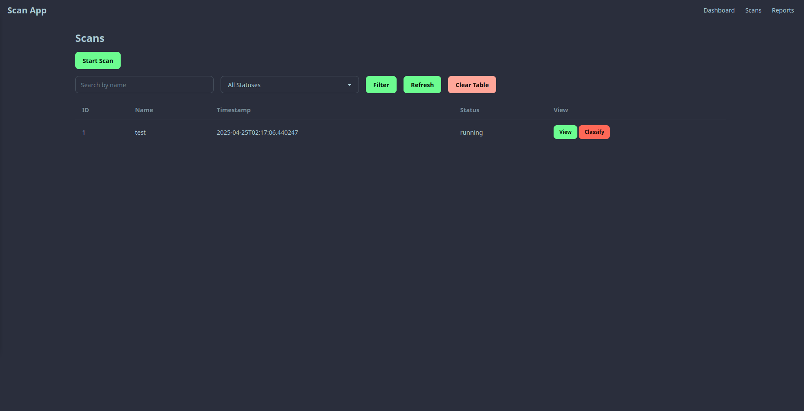
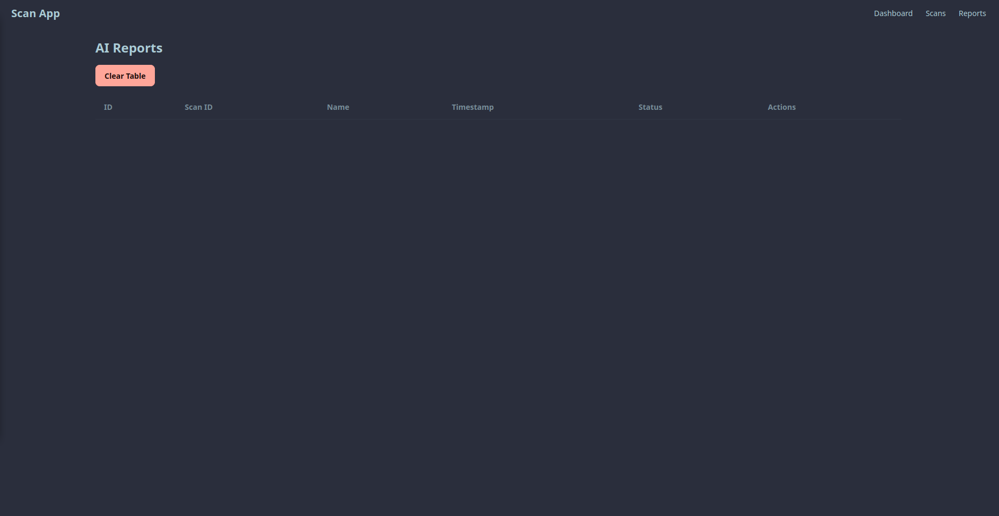
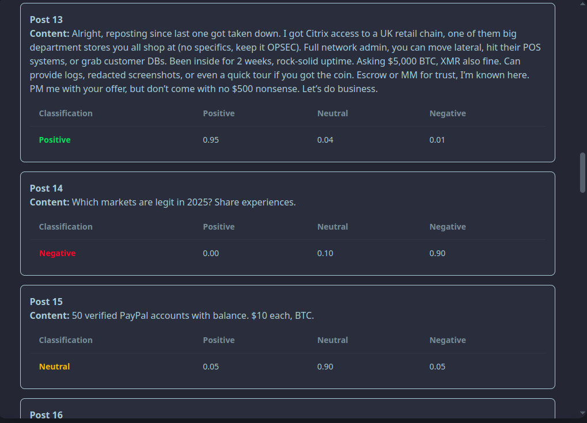
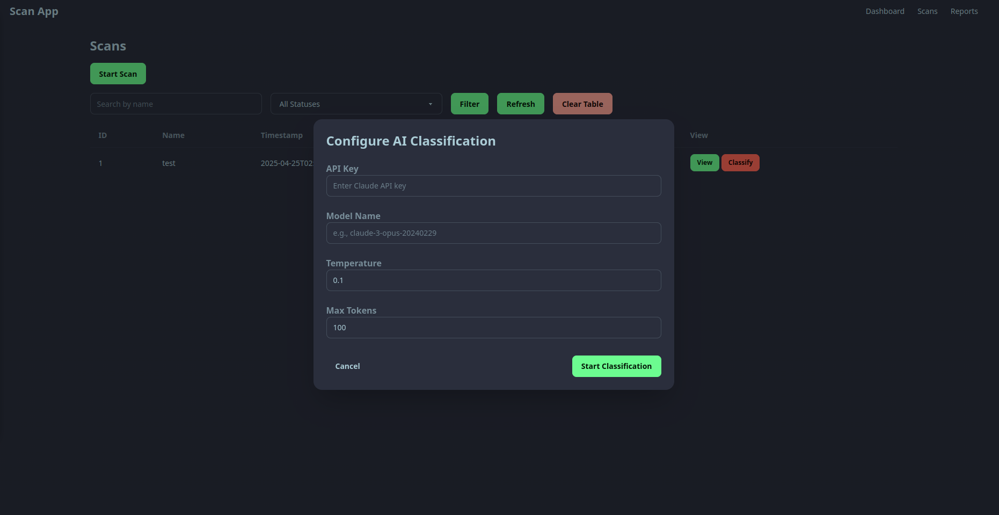

# Minimal Scraper
This web application is part of my blog on "[Intro to cyber threat intelligence](https://hkohi.ca/blog/4)" where I go over basics of threat hunting, initial access brokers, fine-tuning and using existing LLMs for identifying threats.

The blog post serves as an intro to my upcoming course in the field, to see the entire course structure, please visit the following:
https://gist.github.com/0xHamy/596884b3fb6ba551ff532c3abf21c6dc


| Image 1 | Image 2 |
|---------|---------|
|  |  |
|  |  |


## How to run
You can this easily with Docker, here is how:
```
sudo docker compose up --build
```

Access the site @ `http://127.0.0.1:8000`

### How to run it locally
Setup a python virtual environment, install requirements & run the app:
```
cd minimal-scraper
python3 -m venv venv
source venv/bin/activate
pip3 install -r requirements.txt
uvicorn app.main:app --reload
```


## Features
- Modularity
- Web scraper
- Claude integration
- Scan tracking
- Report tracking


## Claude integration
Claude code: [claude.py](./app/services/claude.py)

This Python script defines a `claude_classify` function that uses the Anthropic API to classify text posts based on their content. It determines whether a post discusses selling initial access to a company (e.g., RDP, VPN), selling unrelated items (e.g., accounts, tools), or contains warnings/complaints. 

The function sends a prompt to a specified Claude model (e.g., Sonnet), processes the response, and returns a JSON object with the classification ("Positive", "Neutral", or "Negative") and probability scores. The script includes error handling and an example usage demonstrating classification of a sample post.


### Claude router
The claude module can be interacted with through the router or APIs, here is how [claude_router.py](./app/routers/claude_router.py) works.

The `claude_router.py` module is a FastAPI router that provides endpoints for managing AI-based post classification using the Anthropic Claude model within a darknet marketplace scraping application. It includes three main functionalities:

1. **Start Classification (`POST /claude/start-classification`)**: Initiates a background task to classify posts from a specified scan (identified by `scan_id`) using the Claude model. It accepts parameters like the Anthropic API key, model name, temperature, and max tokens via a Pydantic model (`StartClassification`). The endpoint creates an `AIReport` record in the database, triggers the classification process asynchronously, and returns the report ID.

2. **Retrieve Report (`GET /claude/reports/{report_id}`)**: Fetches the classification results for a specific `AIReport` by its ID. It returns the stored classification data or raises a 404 error if the report is not found.

3. **Delete All Reports (`DELETE /claude/delete-all-reports`)**: Deletes all `AIReport` records from the database, providing a way to reset the classification history.

The module integrates with a SQLAlchemy database to manage `Scan` and `AIReport` models, decodes base64-encoded post data, and uses the `claude_classify` service to perform classifications. It handles errors gracefully, supports asynchronous processing via FastAPI's `BackgroundTasks`, and ensures database transactions are properly managed.


## Tor scraping
Scraper code: [scraper.py](./app/services/scraper.py)

This Python script defines a `scrape_posts` function that scrapes posts from a darknet marketplace hosted on an onion URL. It uses requests to fetch the marketplace page via a SOCKS proxy (e.g., Tor), parses the HTML with BeautifulSoup, and extracts post details (title, category, date, link) from a table. 

For each post, it follows the link to scrape the content, encodes it in base64, and compiles all data into a JSON object. The JSON is then base64-encoded and returned as a string. The script includes error handling and an example usage for scraping a specific onion URL.

### Scan router
This router is used for performing scraping scans with [scans_router.py](./app/routers/scans_router.py). 

The `scans_router.py` module is a FastAPI router that manages the scraping of posts from darknet marketplaces via onion URLs. It provides endpoints to create, list, retrieve, delete, and test connectivity for scans, integrating with a SQLAlchemy database to store `Scan` records. Key functionalities include:

1. **Create Scan (`POST /scans/create-scan`)**: Initiates a background task to scrape posts from a specified onion URL using provided proxies. It creates a `Scan` record with a "running" status and triggers the `scrape_posts` service, returning the scan details.

2. **List Scans (`GET /scans/list`)**: Retrieves all scans, optionally filtered by name or status, returning a list of scan details with decoded results.

3. **Get Scan (`GET /scans/{scan_id}`)**: Fetches details for a specific scan by ID, decoding its base64-encoded result (scraped posts) or returning an error if decoding fails.

4. **Delete All Scans (`DELETE /scans/delete-all`)**: Removes all `Scan` records from the database, resetting the scan history.

5. **Test Connection (`POST /scans/test-connection`)**: Verifies connectivity to an onion URL using provided proxies, ensuring the URL is accessible before initiating a scan.

The module uses Pydantic models for request validation, handles base64-encoded results, and supports asynchronous scraping via FastAPI's `BackgroundTasks`. It ensures robust error handling and database transaction management, making it a core component of the darknet marketplace scraping application.

---

## Datasets
Samples of negative, positive and neutral posts are shared and you can grab them from [datasets](./datasets/), these can help you gain an understanding of what type of data is needed for fine-tuning LLMs. 


